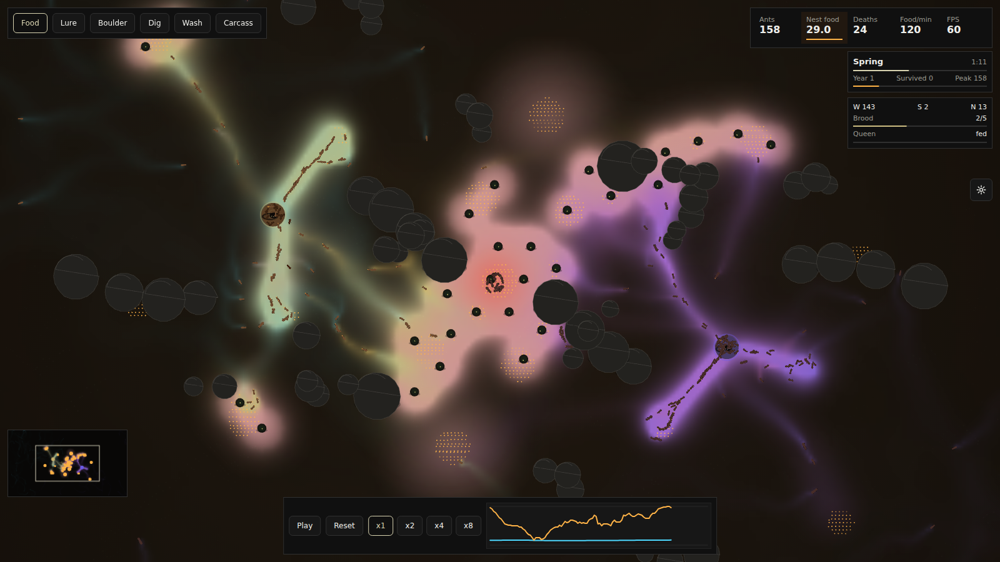

# M0 — The World at War

`npm run dev -- --port 5173`, open a link, press play. The camera now opens on the whole terrarium: both nests are on screen from the first frame.

- **The war:** http://127.0.0.1:5173/?seed=1337 — you win this one, barely.
- **The rival wins:** http://127.0.0.1:5173/?seed=99 — same rules, other outcome.
- **Staged demo** (`scenarios/war-demo.json` — a carcass dropped into no-man's land at 0:30, food behind your line, a lure on the front): http://127.0.0.1:5173/?scenario=ewogICJuYW1lIjogIndhci1kZW1vIiwKICAic2VlZCI6IDEzMzcsCiAgInRpY2tzIjogMTYwMDAsCiAgInRpbWVsaW5lIjogWwogICAgeyAiYXQiOiAxODAwLCAiZG8iOiAiZHJvcENhcmNhc3MiLCAieCI6IDIwNDgsICJ5IjogMTE1MiB9LAogICAgeyAiYXQiOiA1NDAwLCAiZG8iOiAiYXBwbHlUb29sIiwgInRvb2wiOiAiZm9vZCIsICJ4IjogMTgwMCwgInkiOiAxMDgwIH0sCiAgICB7ICJhdCI6IDcyMDAsICJkbyI6ICJhcHBseVRvb2wiLCAidG9vbCI6ICJsdXJlIiwgIngiOiAyMDQ4LCAieSI6IDExNTIgfSwKICAgIHsgImF0IjogOTAwMCwgImRvIjogInNuYXBzaG90IiB9LAogICAgeyAiYXQiOiAxMjAwMCwgImRvIjogImRyb3BDYXJjYXNzIiwgIngiOiAyMDQ4LCAieSI6IDExNTIgfSwKICAgIHsgImF0IjogMTU2MDAsICJkbyI6ICJzbmFwc2hvdCIgfQogIF0KfQo=

## Watch for this

- **Two empires, two palettes.** Gold and cyan bloom out of your nest on the left, violet and magenta out of the rival's on the right. Where the trails meet the ground turns pink — that stripe is the front, and it moves.
- **A clash you can point to.** Around 0:50 the first columns meet in the middle: orange sparks, a shove of the camera, a toast counting the dead. Twenty to thirty ants a side now die fighting in a run. It used to be one.
- **The rival actually lives there.** Its own six larders, its own rock walls, its own bushes — the map is a mirror through the centre. It forages, it starves, it wins sometimes. Nobody feeds it any more.

## Before / after — seed 1337, tick 12000

| Before — the default view. One colony. The rival is off-screen entirely. | Before, zoomed out — the rival is the grey smudge, bottom right, alone. |
| --- | --- |
|  |  |

| After — same seed, same tick, default view: both empires and the front between them. | After, tick 3000 — the first clash, mid-map. |
| --- | --- |
|  |  |
